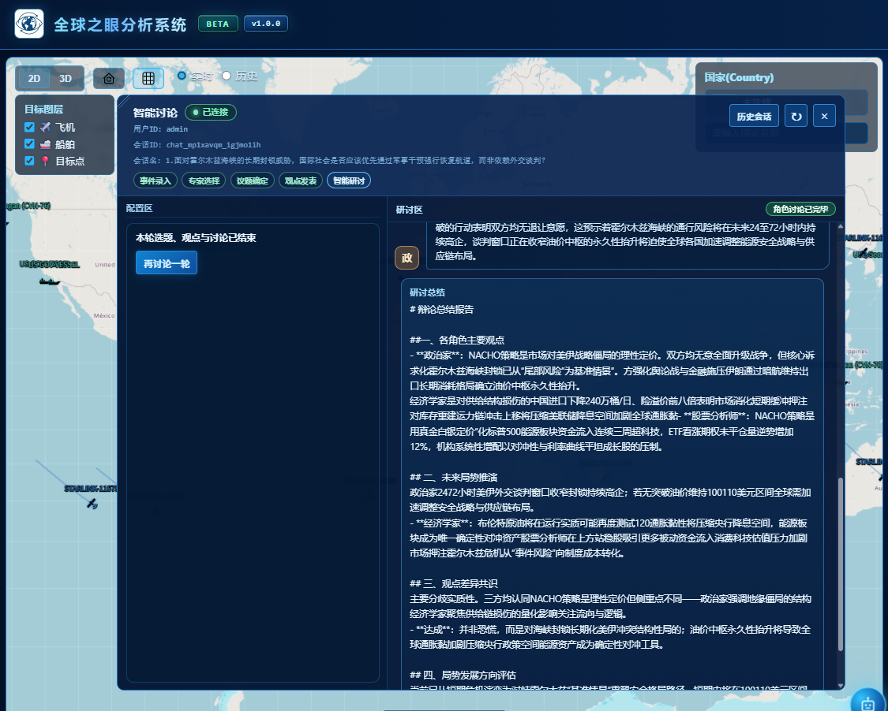
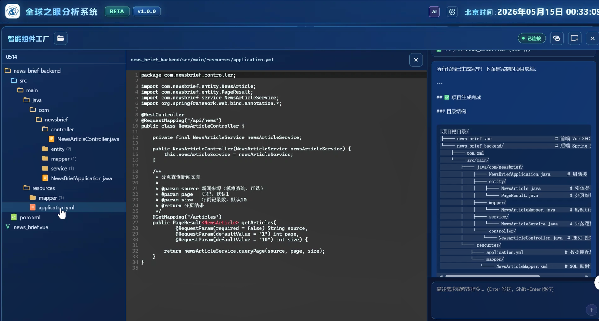
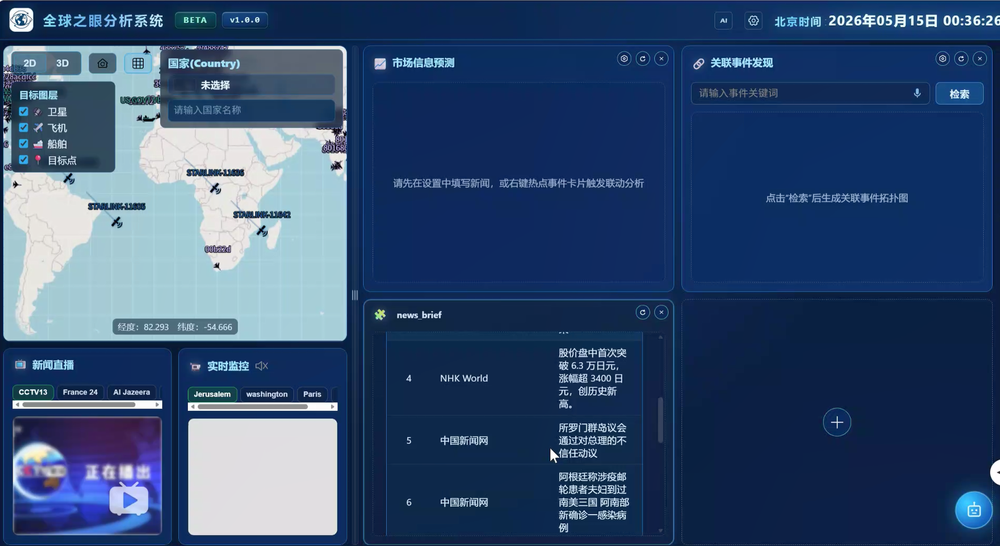
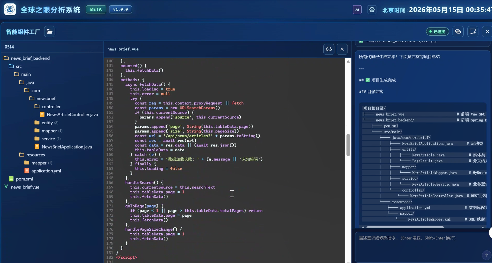

# 🌟 GlobalEye 全球之眼分析系统项目集合

> 新一代热点事件分析与推演系统平台，整合多源数据采集、实时消息推送、多智能体博弈推演等核心能力

---

## 📁 项目结构

```
qbtsxt/
├── qb_analysis_agent/         # 热点事件分析系统 · 多智能体战略推演平台
├── global-eyes/               # 全球之眼后端服务（新闻采集 + WebSocket + AI）
├── qb_SituationSystem_web/    # 全球热点事件监控系统（前端可视化）
└── LightRAG/                  # LightRAG 知识图谱与向量检索
```

> 💡 **提示**：各子项目详情请查看对应目录下的 `README.md` 文件

## 📁 项目截图







---

## 📋 子项目介绍

### 🎯 1. QB Analysis Agent — 热点分析系统 · 多智能体推演平台

**多角色推演平台**，结合 RAG（检索增强生成）与多智能体辩论技术，针对热点事件模拟多方决策过程，进行分析、预测与推演。

#### 核心功能

**热点分析与推演辩论**
- **实时热点分析** — 向量+图数据库双路检索+重排序，从海量热点事件中精准提取关键信息进行分析和预测
- **多角色推演辩论** — 模拟军事战略家、外交官、经济学家等不同领域专家的讨论
- **辩论议题生成** — 基于事件结合 RAG 上下文自动生成 5 个辩论议题
- **立场声明** — 各角色依据身份、立场与检索热点事件发表初始立场
- **多轮推演辩论** — 加权随机调度 + 回复链机制，模拟真实博弈中的策略互动
- **辩论总结** — 自动生成结构化总结报告（立场、分歧、共识与未来展望）

**智能技能与工具**
- **可扩展技能体系** — 基于 JSON 配置动态加载工具，支持自定义 API 集成
- **数据查询工具** — 通过技能系统查询各类数据规格与动态信息
- **角色技能管理** — 通过 API 上传/下载/删除 Markdown 格式角色人设

**AI 代码生成**
- **智能代码生成** — 独立的 AI 代码生成服务，支持 SSE 流式输出和浏览器端工具执行
- **三种工作模式** — `modify`（读写编辑文件）、`dryrun`（仅预览计划）、`analyze`（仅分析）
- **安全防护** — 路径安全校验，拒绝绝对路径和路径穿越攻击

**动态插件系统**
- **Vue 插件 CRUD** — 通过 MinIO 存储上传/下载/列表/删除 Vue SFC 插件
- **SFC 解析** — 服务端解析 Vue 单文件组件的 template、script、style
- **HTTP 代理** — 通过服务器代理请求解决浏览器跨域问题
- **用户隔离** — 插件存储和后端 URL 配置按用户名隔离

**技术栈**：FastAPI、LangChain/LangGraph、Milvus、Neo4j、Redis、MinIO、DashScope Embeddings、SSE

> **启动本项目与 LightRAG 项目即可体验多智能体多轮战略辩论功能，详细步骤参考 qb_analysis_agent 目录下的 README-zh.md 文件**

---

### 🖥️ 2. QB SituationSystem Web（全球热点事件监控系统前端）

面向大屏与桌面的全球热点事件分析前端：左侧为 **2D（OpenLayers）/ 3D（Cesium）** 统一地图视图与底坞资讯区，右侧为可编排的热点事件业务网格；顶栏提供 **系统设置** 与 **智能组件工厂**；右下角 **智能讨论** 助手与地图主区、关联事件等模块联动。

#### 整体架构

```
顶栏（Logo / 智能组件工厂 / 设置 / 北京时间）
├─ 主区（可拖拽竖向分割条）
│  ├─ 左栏：地图主区（SituationIndex → 2D OpenLayersScene | 3D GlobeScene）
│  │       + 底坞（实时新闻 / 实时监控）
│  └─ 右栏：热点事件网格（LowerTabs，可增删换位与面板事件联动）
├─ 全屏覆盖：智能组件工厂（IntelGenStudioWorkspace）
├─ 模态：系统设置（热点事件面板配置等）
└─ 浮动：智能讨论助手（IntelligenceAssistant）
```

#### 主要功能

- **2D/3D 一键切换** — 统一国家搜索、选中、高亮；2D 支持视角归位、经纬网显隐等
- **实时与历史回放** — WebSocket 按 `dataType` 订阅（如 `aircraft`、`ship`）并动态渲染；历史回放等能力在场景浮层中扩展

- **热点事件网格** — `LowerTabs` 网格布局，支持拖拽换位、边缘缩放、刷新、删除与空位新增；面板间事件联动（如异动预警选中后自动带入分析组件）
- **底坞** — 左侧底部固定实时新闻、实时监控面板，与地图主区同屏浏览
- **智能组件工厂** — 顶栏入口打开全屏工作台，支持 AI 辅助生成/编辑热点事件侧 Vue 单文件组件、树形资源浏览、工具调用展示等；浏览器内编译依赖 `runtimeCompiler: true`
- **个性化插件挂载** — 生成或下发的插件可动态挂载；网络请求经 `postPluginProxy` 走统一智能化基址
- **智能讨论助手** — 多角色讨论、议题与流式输出、会话历史；可与外部上下文联动

#### 右侧热点事件网格（默认可挂载类型）

由 `src/components/LowerTabs.vue` 与 `src/components/intelComponents/js/intelPanelMenuItems.js` 约定类型键：

- 地区热点事件
- 市场信息预测
- 关联事件发现

（具体面板实现位于 `src/components/intelComponents/`，可按后端与产品继续扩展。）

#### 智能化统一后端

AI 代码（aicode）、讨论室、个性化插件列表/代理请求等，共用同一浏览器可见前缀 **`/intelligentization-api`**（开发环境由 `vue.config.js` 代理到统一服务；生产由网关/Nginx 同等反代并剥前缀）。基址解析见 `src/api/intelligentizationApiBase.js`。

**技术栈**：Vue 2.7、OpenLayers 10、Cesium 1.92、ECharts、Axios、Fetch（SSE）、WebSocket、CodeMirror

---

### 🕷️ 3. Global Eyes（全球之眼后端服务）

Global Eyes 项目套件中的后端服务模块，基于 Spring Boot 构建，整合新闻采集、航空与船舶轨迹、风险预测、知识图谱、实时消息推送和 AI 分析能力。服务默认监听 `8081` 端口。

#### 核心能力

- 🌐 **多源 RSS 新闻采集** — 文章解析、统计，支持多后端存储（MySQL、Elasticsearch、RocketMQ）
- ✈️ **OpenSky 航空器追踪** — 状态同步、历史轨迹查询和 GeoJSON 轨迹输出
- 🚢 **AIS 船舶追踪** — 数据导入、查询、筛选和 Excel 导入
- 🗺️ **ACLED 风险地图** — 聚合数据导入、行政区边界导入、趋势和详情查询
- 📊 **CAST 冲突预测** — 预测数据导入、风险趋势、排名和综合报告
- 🕸️ **Neo4j 知识图谱** — 热点事件、地区和文章关系查询
- 📡 **原生 WebSocket 与 STOMP 消息推送** — 订阅、广播、单播和统计
- 🧠 **Spring AI Alibaba / DashScope** — 新闻解析、翻译和股票影响分析

**技术栈**：Java 21、Spring Boot 3.4.5、Spring Web/WebFlux/WebSocket/STOMP、Spring Data JPA/Neo4j/Elasticsearch、MySQL、Redis、Neo4j、Elasticsearch、RocketMQ、Spring Cloud Alibaba Nacos、Spring AI Alibaba DashScope、AgentScope、WebMagic、Rome、Jsoup、EasyExcel、Playwright

---

## 🚀 快速开始

### 后端服务启动顺序

1. **启动 Global Eyes 服务**（端口 8081）
   ```bash
   cd global-eyes
   mvn -pl global_eye_service -am spring-boot:run
   ```

2. **启动 QB Analysis Agent**（端口 9092）
   ```bash
   cd qb_analysis_agent
   python front/web_api.py
   ```

3. **启动前端**（端口 8080）
   ```bash
   cd qb_SituationSystem_web
   npm install
   npm run serve
   ```

> **了解子项目具体情况还请进入各项目目录下的 README.md 文件**

## 📊 架构概览

```
┌─────────────────────────────────────────────────────────────────┐
│                    前端层 (qb_SituationSystem_web)               │
│         Vue 2.7 + OpenLayers + Cesium + ECharts                │
└─────────────────────────┬───────────────────────────────────────┘
                          │ WebSocket / REST / SSE
┌─────────────────────────▼───────────────────────────────────────┐
│                     服务层                                      │
│  ┌──────────────────────────────────────────┐                  │
│  │           Global Eyes 服务                │                  │
│  │  (新闻采集 + AIS/ACLED/CAST +            │                  │
│  │   WebSocket + AI 分析)                   │                  │
│  └────────┬─────────────────────────────────┘                  │
│           │                                                     │
│  ┌────────▼─────────────────────────────────┐                  │
│  │            QB Analysis Agent              │                  │
│  │  (多智能体推演 + RAG + 代码生成)           │                  │
│  └──────────────────────────────────────────┘                  │
└─────────────────────────┬───────────────────────────────────────┘
                          │
┌─────────────────────────▼───────────────────────────────────────┐
│                    数据存储层                                    │
│  MySQL │ Redis │ Milvus │ Neo4j │ Elasticsearch │ RocketMQ     │
└─────────────────────────────────────────────────────────────────┘
```

---

## ⚠️ 使用须知与免责声明

### 📚 使用范围
本项目仅供**学习研究**、**学术探讨**和**技术验证**目的使用。

### 📜 合规承诺
- 严禁将本项目用于任何商业用途或盈利性活动
- 严禁将本项目用于任何违法、违规或侵犯他人权益的行为
- 使用本项目即表示您已充分了解并同意遵守相关法律法规

### 🕷️ 数据采集规范
- 项目中的数据采集功能仅用于技术学习和研究目的
- 使用者必须遵守目标网站的 `robots.txt` 协议和使用条款
- 使用者必须确保数据采集行为符合相关法律法规，不得进行恶意爬取或数据滥用
- 因使用数据采集功能产生的任何法律后果由使用者自行承担

### 🧠 分析功能限制
- 项目涉及的数据分析功能仅供学术研究使用
- 严禁将分析结果用于商业决策或盈利目的
- 使用者应确保所分析数据的合法性和合规性

### 💡 技术免责
- 本项目按"现状"提供，不提供任何明示或暗示的保证
- 作者不对使用本项目造成的任何直接或间接损失承担责任
- 使用者应自行评估项目的适用性和风险

> ⚠️ **重要提醒**：使用本项目前，请务必充分了解并遵守当地法律法规。任何因违反法律法规使用本项目而产生的后果，均由使用者自行承担。

---

## 致谢

本项目引用了开源项目 [LightRAG](https://github.com/HKUDS/LightRAG) 用于基于图的知识检索功能。在此衷心感谢 LightRAG 开发团队的贡献。

## 📄 许可证

本项目采用 GPLv3 开源协议。详细信息请参阅LICENSE文件。

---

**Made with ❤️ by GlobalEye Team**

---

*Last updated: 2026*
