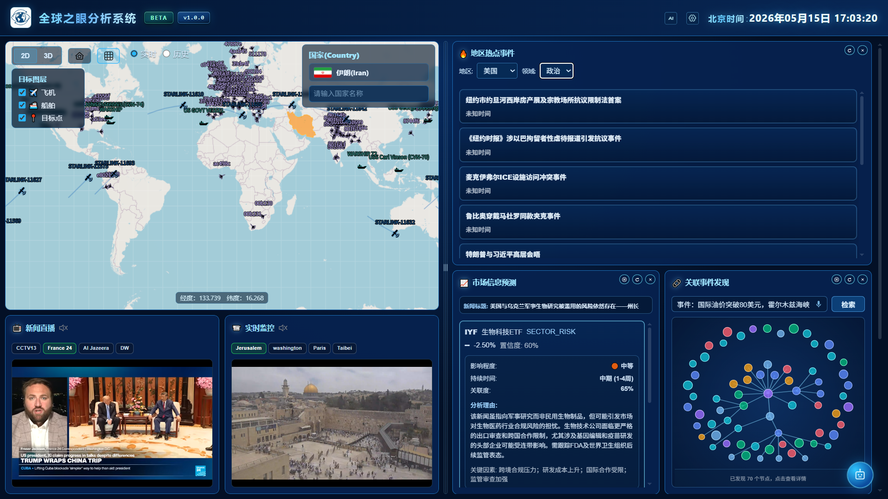
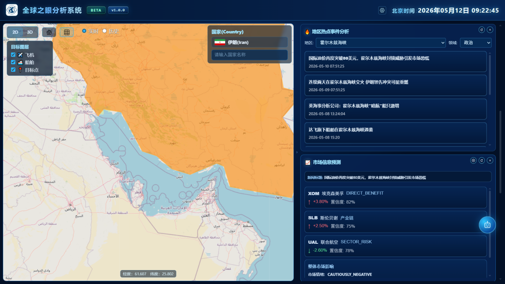
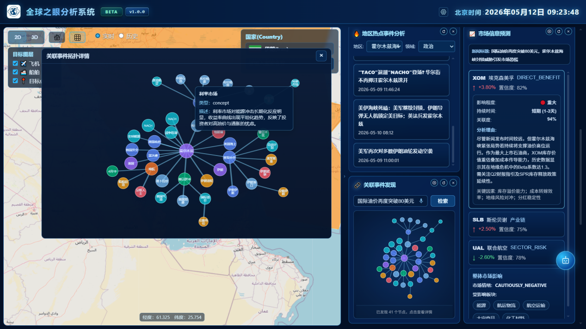
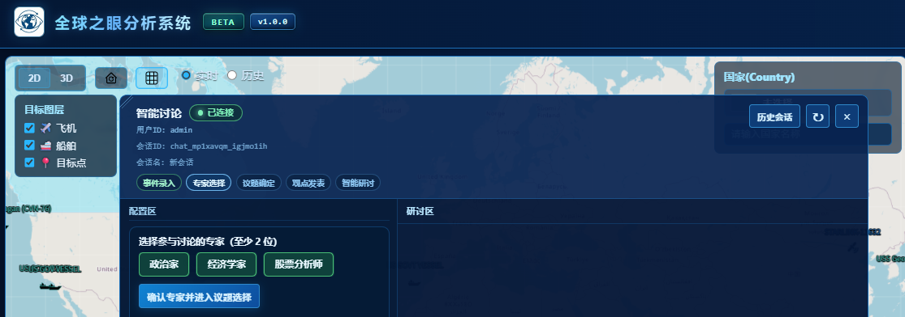
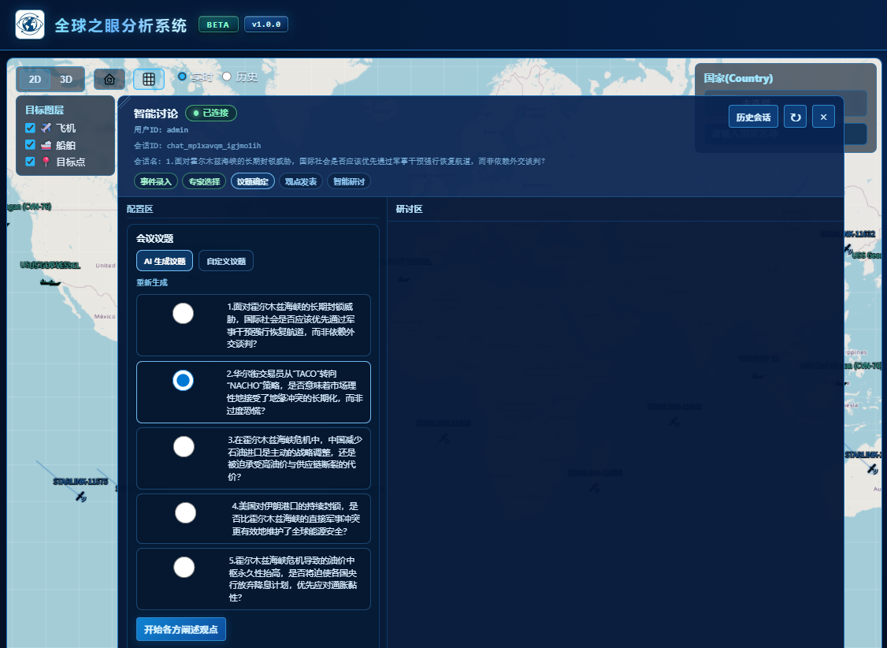
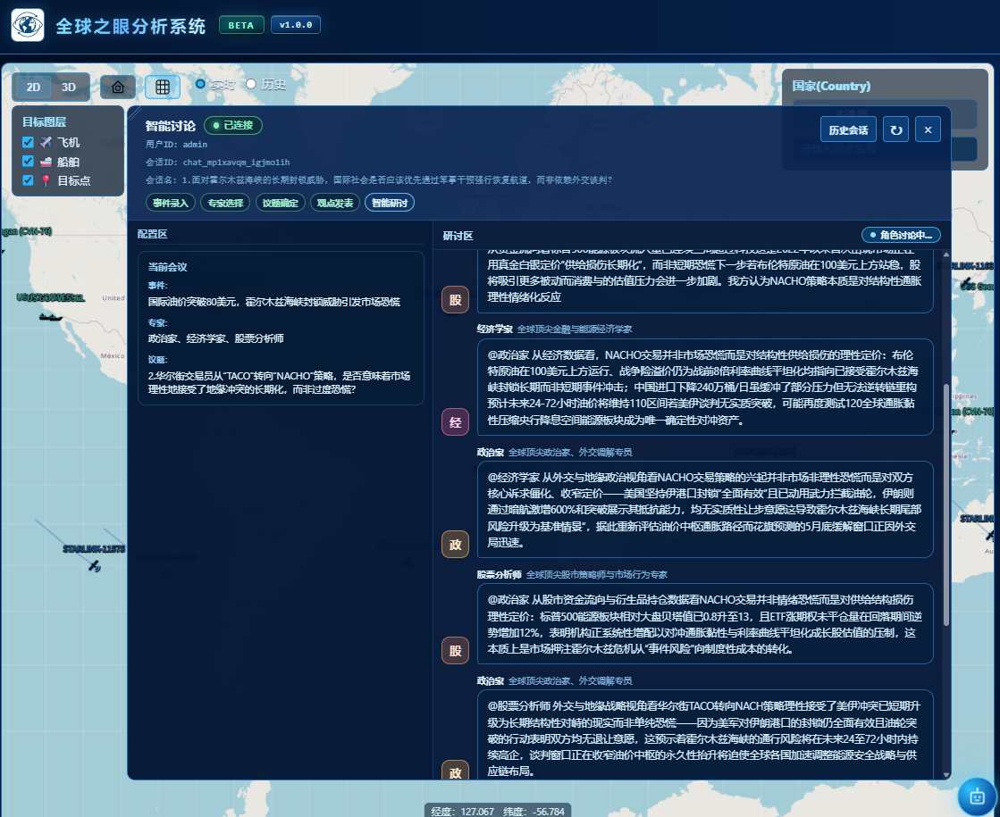

# The GlobalEye Surveillance System Project Suite

> A new-generation intelligence analysis and situation monitoring system platform integrating core capabilities such as multi-source data collection, real-time message push, satellite orbit analysis, and multi-agent game deduction.

---

## Project Structure

```
qbtsxt/
├── qb_analysis_agent/         # Intelligence Analysis System · Multi-Agent Strategic Deduction Platform
├── global-eyes/               # Global Eyes Backend Service (News Crawling + Spatial Data + WebSocket + AI)
├── qb_SituationSystem_web/    # Global Intelligence Situation Monitoring System (Frontend Visualization)
└── LightRAG/                  # LightRAG Knowledge Graph & Vector Retrieval
```

> **Tip**: For details on each sub-project, see the `README.md` file in the corresponding directory.

## Project Screenshots








---

## Sub-project Introduction

### 1. QB Analysis Agent — Hotspot Analysis System · Multi-Agent Deduction Platform

A **multi-role deduction platform** that combines RAG (Retrieval-Augmented Generation) with multi-agent debate technology to simulate multi-party decision-making processes for hotspot event analysis, prediction, and deduction.

#### Core Features

**Hotspot Analysis & Deduction Debate**
- **Real-time Hotspot Analysis** — Analyze and predict hotspot events using dual-path retrieval from vector + graph databases with reranking
- **Multi-role Deduction Debate** — Simulate discussions among experts from different domains (military strategists, diplomats, economists, etc.)
- **Role Auto-Selection** — Automatically identify relevant countries and roles from hotspot events
- **Debate Topic Generation** — Auto-generate 5 debate topics from events with RAG context
- **Position Statements** — Each role states its initial position based on identity, stance, and retrieved intelligence
- **Multi-turn Deduction Debate** — Weighted random scheduling with reply chains for realistic discussion flow
- **Debate Summarization** — Auto-generate structured summary reports (positions, divergences, consensus, and future projections)

**Intelligent Skills & Tools**
- **Extensible Skill System** — Dynamic skill loading from JSON configs with tool definitions and API integration, invoked via `/skill_name query` syntax
- **Data Query Tools** — Query various data specifications and dynamic information via the skill system
- **Role Skill Management** — Upload/download/delete role personas as Markdown files via API

**AI Code Generation**
- **Intelligent Code Generation** — Standalone AI code generation service with SSE streaming and browser-side tool execution
- **Three Working Modes** — `modify` (read/write/edit files), `dryrun` (preview plan only), `analyze` (analysis only)
- **Security Protection** — Path safety validation rejecting absolute paths and path traversal attacks

**Dynamic Plugin System**
- **Vue Plugin CRUD** — Upload/download/list/delete Vue SFC plugins via MinIO storage
- **SFC Parsing** — Server-side parsing of Vue single-file component template, script, and style
- **HTTP Proxy** — Solve browser CORS issues by proxying requests through the server to user's local backend
- **Per-User Isolation** — Plugin storage and backend URL configuration isolated by username

**Tech Stack**: FastAPI, LangChain/LangGraph, Milvus, Neo4j, Redis, MinIO, DashScope Embeddings, SSE

> To experience the multi-agent multi-round strategic debate functionality, start this project along with the LightRAG project. See the README.md file in the qb_analysis_agent directory for detailed steps.

---

### 2. QB SituationSystem Web (Global Intelligence Situation Monitoring Frontend)

A situation visualization frontend designed for large screens and desktops, supporting **2D (OpenLayers)** and **3D (Cesium)** scenes to display satellites, aircraft, ships, and intelligence points, integrated with right-side intelligence business panels, real-time alerts, an intelligent discussion assistant, and a smart component factory.

#### Overall Architecture

```
Top Bar (Logo / Smart Component Factory / Settings / Beijing Time)
├─ Main Area (draggable vertical splitter)
│  ├─ Left: Map area (SituationIndex → 2D OpenLayersScene | 3D GlobeScene)
│  │       + Bottom Dock (Real-time News / Real-time Monitoring)
│  └─ Right: Intelligence Grid (LowerTabs, add/remove/reorder + panel event linking)
├─ Fullscreen Overlay: Smart Component Factory (IntelGenStudioWorkspace)
├─ Modal: System Settings (intel panel config, etc.)
└─ Floating: Intelligent Discussion Assistant (IntelligenceAssistant)
```

#### Main Features

- **2D/3D One-Click Switch** — Unified country search, selection, and highlight interaction; 2D supports view reset and graticule toggle
- **Real-time & Historical Playback** — WebSocket subscription by `dataType` (e.g., `aircraft`, `ship`) with dynamic rendering; historical playback expandable in scene overlays
- **Satellite Capabilities** — Real-time sub-satellite point trajectory, orbit change alerts (WARN) with flashing markers, right-click coverage display (TLE + timestamp coverage circle)
- **Intelligence Grid** — `LowerTabs` grid layout with drag-to-reorder, edge resize, refresh, delete, and empty slot addition; inter-panel event linking (e.g., anomaly alert selection auto-populates analysis component)
- **Bottom Dock** — Fixed real-time news and monitoring panels at the bottom-left, visible alongside the map
- **Smart Component Factory** — Top bar shortcut opens a fullscreen workbench supporting AI-assisted generation/editing of Vue SFC components, tree-based resource browsing, and tool-call visualization; in-browser compilation relies on `runtimeCompiler: true`
- **Personalized Plugin Mounting** — Generated or distributed plugins mount dynamically; network requests routed through `postPluginProxy` via unified intelligentization base URL
- **Intelligent Discussion Assistant** — Multi-role discussion, topic generation with streaming output, session management; supports external context linkage from related events and situation modules

#### Right-Side Intelligence Grid (Default Mountable Types)

Component types configured in `src/components/LowerTabs.vue` and `src/components/intelComponents/js/intelPanelMenuItems.js`:

- Regional Hotspot Events
- Market Information Forecast
- Related Event Discovery

(Additional panel implementations in `src/components/intelComponents/`, extensible by backend and product requirements.)

#### Unified Intelligentization Backend

All AI code, discussion, personalized plugin list/proxy requests share the same browser-visible prefix **`/intelligentization-api`** (proxied by devServer in development; reverse-proxied by gateway/Nginx in production, stripping the prefix). Base URL resolution is in `src/api/intelligentizationApiBase.js`.

**Tech Stack**: Vue 2.7, OpenLayers 10, Cesium 1.92, ECharts, Axios, Fetch (SSE), WebSocket, CodeMirror

---

### 3. Global Eyes (Backend Service)

The backend service module of the Global Eyes project suite, built with Spring Boot, integrating news crawling, spatial object data, aircraft and vessel tracking, risk forecasting, knowledge graph, real-time messaging, and AI-powered analysis. The service listens on port `8081` by default.

#### Core Capabilities

- **Multi-source RSS News Crawling** — Article parsing, statistics, and multi-backend storage (MySQL, Elasticsearch, RocketMQ)
- **OpenSky Aircraft Tracking** — State synchronization, historical trajectory query, and GeoJSON trajectory output
- **AIS Vessel Tracking** — Data import, query, filtering, and Excel import for ship trajectories
- **ACLED Risk Map** — Aggregated data import, ADM1 boundary import, trend and detail queries
- **CAST Conflict Forecast** — Forecast import, risk trends, rankings, risk windows, and aggregate reports
- **Neo4j Knowledge Graph** — Hotspot events, location, and article relationship queries
- **Native WebSocket & STOMP Messaging** — Subscription, broadcast, unicast, and statistics
- **Spring AI Alibaba / DashScope** — News parsing, translation, and stock impact analysis

**Tech Stack**: Java 21, Spring Boot 3.4.5, Spring Web/WebFlux/WebSocket/STOMP, Spring Data JPA/Neo4j/Elasticsearch, MySQL, Redis, Neo4j, Elasticsearch, RocketMQ, Spring Cloud Alibaba Nacos, Spring AI Alibaba DashScope, AgentScope, Orekit, WebMagic, Rome, Jsoup, EasyExcel, Playwright

---

## Quick Start

### Backend Service Startup Order

1. **Start Global Eyes Service** (Port 8081)
   ```bash
   cd global-eyes
   mvn -pl global_eye_service -am spring-boot:run
   ```

2. **Start QB Analysis Agent** (Port 9092)
   ```bash
   cd qb_analysis_agent
   python front/web_api.py
   ```

3. **Start Frontend** (Port 8080)
   ```bash
   cd qb_SituationSystem_web
   npm install
   npm run serve
   ```

> For detailed information on each sub-project, please refer to the README.md files in their respective directories.

---

## Environment Requirements

| Project | Language | Version Requirement |
|---------|----------|---------------------|
| qb_analysis_agent | Python | 3.10+ |
| global-eyes | Java | 21+ |
| qb_SituationSystem_web | JavaScript/TypeScript | Node.js 16.x/18.x |

---

## Architecture Overview

```
┌─────────────────────────────────────────────────────────────────┐
│              Frontend Layer (qb_SituationSystem_web)            │
│          Vue 2.7 + OpenLayers + Cesium + ECharts               │
└─────────────────────────┬───────────────────────────────────────┘
                          │ WebSocket / REST / SSE
┌─────────────────────────▼───────────────────────────────────────┐
│                        Service Layer                           │
│  ┌──────────────────────────────────────────┐                  │
│  │           Global Eyes Service             │                  │
│  │  (News Crawling + AIS/ACLED/CAST +       │                  │
│  │   WebSocket + AI Analysis)               │                  │
│  └────────┬─────────────────────────────────┘                  │
│           │                                                     │
│  ┌────────▼─────────────────────────────────┐                  │
│  │            QB Analysis Agent              │                  │
│  │  (Multi-Agent Deduction + RAG + Code Gen)│                  │
│  └──────────────────────────────────────────┘                  │
└─────────────────────────┬───────────────────────────────────────┘
                          │
┌─────────────────────────▼───────────────────────────────────────┐
│                    Data Storage Layer                           │
│  MySQL │ Redis │ Milvus │ Neo4j │ Elasticsearch │ RocketMQ     │
└─────────────────────────────────────────────────────────────────┘
```

---

## Usage Notice & Disclaimer

### Scope of Use
This project is intended for **learning and research**, **academic discussion**, and **technical validation** purposes only.

### Compliance Commitment
- Commercial use or profit-making activities are strictly prohibited
- Any illegal, non-compliant, or rights-infringing use is strictly prohibited
- By using this project, you acknowledge that you fully understand and agree to comply with relevant laws and regulations

### Data Collection Guidelines
- Data collection features in this project are for technical learning and research purposes only
- Users must comply with target website `robots.txt` protocols and terms of use
- Users must ensure data collection behavior complies with applicable laws and regulations; malicious scraping or data misuse is prohibited
- Any legal consequences arising from the use of data collection features shall be borne solely by the user

### Analysis Feature Limitations
- Data analysis features are for academic research use only
- Using analysis results for commercial decision-making or profit-making purposes is strictly prohibited
- Users should ensure the legality and compliance of the data being analyzed

### Technical Disclaimer
- This project is provided "as is" without any express or implied warranties
- The authors shall not be liable for any direct or indirect damages resulting from the use of this project
- Users should independently assess the suitability and risks of this project

> **Important**: Please ensure you fully understand and comply with local laws and regulations before using this project. Any consequences arising from illegal or non-compliant use shall be borne solely by the user.

---

## Acknowledgments

This project references the open-source project [LightRAG](https://github.com/HKUDS/LightRAG) for graph-based knowledge retrieval functionality. Sincere thanks to the LightRAG development team for their contributions.

## License

This project is licensed under the GPLv3 open source license. See the LICENSE file for details.

---

**Made with ❤️ by GlobalEye Team**

---

*Last updated: 2026*
